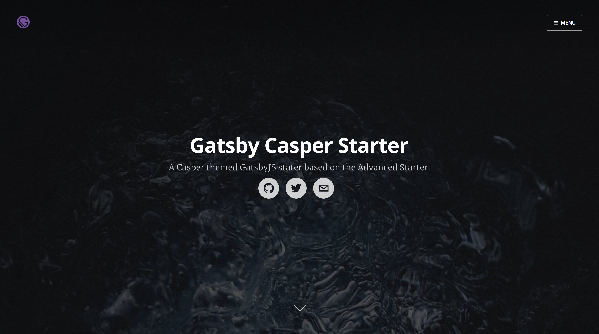

<div align="center">
    
</div>

# Terrafarm Gatsby Casper Demo
[](https://codeclimate.com/github/terrafarm/gatsby-casper-demo)
[](https://codeclimate.com/github/terrafarm/gatsby-casper-demo)
[](https://conventionalcommits.org)

A static site with [Gatsby](https://github.com/gatsbyjs/gatsby/), utilizing the popular [Casper (v1.4)](https://github.com/TryGhost/Casper/tree/1.4) theme authored by [Ghost.io](https://ghost.io/).  The project is based on [Gatsby Starter Casper](https://github.com/haysclark/gatsby-casper-demo).

[Demo website.](https://terrafarm.github.io/gatsby-casper-demo/)



## Features


* [GatsbyJS V1](https://www.gatsbyjs.org/blog/gatsby-first-beta-release/): brings progressive web app features such as automatic code and data splitting (by route), prefetching, with service worker/offline-first support and PRPL pattern.
* [Gatsby-Pagination](https://github.com/infinitedescent/gatsby-pagination).
* Blazing fast loading times thanks to pre-rendered HTML and automatic chunk loading of JS files
* Separate components for everything
* High configurability:
  * Site information
  * Site social profiles
  * Copyright information
  * More!
* Author segment
  * Name
  * Location
  * Description
  * Links
  * Follow Me button
  * Social profiles
* Posts in Markdown
  * Code syntax highlighting
  * Embed YouTube videos
  * Embed Tweets
  * Pages support pagination
  * Read More linked paginated pages  
* Tags
  * Separate page for posts under each tag
  * Pages support pagination.
* Categories (pages generated but not linked in theme)
  * Separate page for posts under each category
* Disqus support (needs to be uncommented)
  * Notifications about new disqus comments
* Google Analytics support
* NPM scripts for GitHub Pages deployment
* Social features (uncomment code to use)
  * Twitter tweet button
  * Facebook share/share count
  * Google+ share button
  * easily to add more!
* SEO
  * Sitemap generation
  * robots.txt
  * General description tags
  * Schema.org JSONLD (Google Rich Snippets)
  * OpenGraph Tags (Facebook/Google+/Pinterest)
  * Twitter Tags (Twitter Cards)
* RSS feeds
* Loading progress for slow networks
* Offline support
* Web App Manifest support
* Development tools
  * ESLint for linting
  * Prettier for code style
  * Remark-Lint for linting Markdown
  * write-good for linting English prose
  * gh-pages for deploying to GitHub pages
  * CodeClimate configuration file and badge

## Getting Started

Install this project (assuming [Gatsby](https://github.com/gatsbyjs/gatsby/) is installed) by running from your CLI:

```sh
gatsby new YourProjectName https://github.com/terrafarm/gatsby-casper-demo
gatsby develop
```

Alternatively, you can clone the repo or a fork of the repo and install it manually.

```sh
git clone https://github.com/terrafarm/gatsby-casper-demo YourProjectName # Clone the project
cd YourProjectname
rm -rf .git # Optional, you can leave the .git history for future rebasing
npm install # or yarn install
npm run develop # or gatsby develop
```

## Configuration

 Edit the export object in `data/SiteConfig`:

## Content

### Posts

Posts are authored using Markdown and include some optional YAML frontmatter data properties.  Each post should have a separate folder for the .md file in addition to any images or other media related to that post.  Posts are stored in a subfolder in the ```/content/``` directory; the target subfolder is set by the _blogPostDir_ property in _SiteConfig.js_.

### Authors

Each post can reference the author of the post, if the author is not set the default author will be used; which is controlled by the _blogAuthorId_ property in _SiteConfig.js_.  All authors, including the default author (aka _blodAuthorId_) must have an author JSON file.  These JSON files MUST be stored in a folder names ```authors```, for Gatsby to parse them correctly.  The location of this ```authors``` folder can be controlled by the _blogAuthorDir_ property in _SiteConfig.js_. It IS possible to have the ```authors``` folder inside the  _blogPostDir_ folder.

## Contributing

👍🎉 First off, thanks for taking the time to contribute! 🎉👍

The project uses [Conventional Commits](https://conventionalcommits.org/) which are simple and easy to follow. In general, use your best judgment, and feel free to propose changes by creating an issue and then mention the issue in your pull request.

## License

MIT
